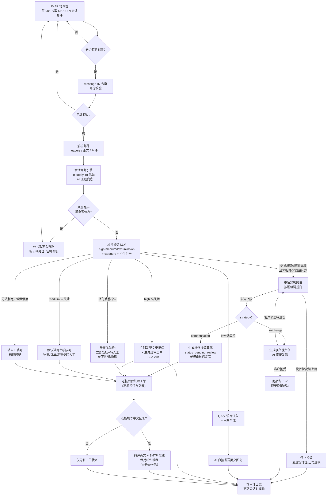

# 售后邮件智能回复系统 — 技术方案 

## 一、技术栈总览

| 层级 | 技术选型 | 版本 | 说明 |
|---|---|---|---|
| 后端语言 | Python | 3.11+ | FastAPI ASGI 框架 |
| 编排方式 | **固定工作流** | 纯 Python | 轻量 pipeline 顺序编排，无 Agent 框架；LLM 仅作分类/生成节点，流程路由由代码控制 |
| 大模型 | **DeepSeek** | deepseek-v4-flash | 默认 provider；预留 Anthropic/OpenAI 替换口 |
| 数据库 | SQLite | WAL 模式 | 本地持久化；`create_all` 建表 + seed 脚本，无迁移框架 |
| 前端框架 | React | 18 | TypeScript + Vite |
| UI 组件 | Tailwind | — | 轻量、桌面端优先 |
| 处理方式 | 同步串行 | — | IMAP 拉一封处理一封，无任务队列、无 worker |
| 部署 | Docker Compose | — | 单机 VPS |
| 邮件协议 | IMAP / SMTP | — | Hostinger Titan Email |

---

## 二、系统架构

### 2.1 分层架构图

```
┌─────────────────────────────────────────────────────────────────┐
│                        接入层（Access）                          │
│  ┌──────────────┐  ┌──────────────┐  ┌──────────────────────┐ │
│  │ IMAP 轮询器   │  │ SMTP 发送器   │  │ Web 后台（React SPA）│ │
│  │ 每 90s 拉取   │  │ smtplib+retry│  │ 老板浏览器           │ │
│  └──────┬───────┘  └──────▲───────┘  └──────────┬───────────┘ │
└─────────┼──────────────────┼─────────────────────┼─────────────┘
          │                  │                     │
┌─────────▼──────────────────┼─────────────────────┼─────────────┐
│                        业务层（Business）                        │
│  ┌──────────────┐  ┌──────────────┐  ┌──────────────────────┐ │
│  │ 邮件接入服务  │  │ 会话合并引擎  │  │  风险分类服务     │ │
│  │ IngestService│  │ Conversation  │  │ ClassifierService │ │
│  └──────┬───────┘  └──────┬───────┘  └──────────┬───────────┘ │
│         │                  │                      │              │
│  ┌──────▼──────────────────▼──────────────────────▼───────────┐ │
│  │       固定工作流 Pipeline（纯 Python 顺序编排，无框架）    │ │
│  │  分类 → 拒付信号拦截 → 挽留策略路由 → 回复生成 / 安抚 / 工单│ │
│  └──────┬────────────────────────────────────────────────────┘ │
│         │                                                       │
│  ┌──────▼───────┐  ┌──────────────┐  ┌──────────────────────┐ │
│  │ 知识库注入    │  │ 翻译服务     │  │  SMTP 发送服务       │ │
│  │ Knowledge    │  │ Translator    │  │  Mailer              │ │
│  └──────┬───────┘  └──────────────┘  └──────────┬───────────┘ │
│         │                                          │              │
│  ┌──────▼──────────────────────────────────────────▼───────────┐ │
│  │  审计日志 / 告警通道 / 暂停开关 / APScheduler 调度器       │ │
│  └────────────────────────────────────────────────────────────┘ │
└─────────────────────────────────────────────────────────────────┘
          │                     │
┌─────────▼─────────────────────▼─────────────────────────────────┐
│                        数据层（Data）                            │
│  ┌────────────┐  ┌────────────┐  ┌──────────┐                │
│  │ SQLite WAL  │  │ 本地文件    │  │ 知识库    │                │
│  │ app.db      │  │ 附件/导出   │  │ 原文/QA   │                │
│  └────────────┘  └────────────┘  └──────────┘                │
└─────────────────────────────────────────────────────────────────┘
          │                     │
┌─────────▼─────────────────────▼─────────────────────────────────┐
│                      外部依赖（External）                        │
│  ┌──────────────┐  ┌──────────────┐  ┌──────────────────────┐ │
│  │ DeepSeek API │  │ Titan Email  │  │  告警通道            │ │
│  │ (默认 LLM)    │  │ IMAP / SMTP  │  │  Bark / SMTP / Webhook│ │
│  └──────────────┘  └──────────────┘  └──────────────────────┘ │
└─────────────────────────────────────────────────────────────────┘
```

### 2.2 系统工作流程图



---

### 2.3 数据流（邮件生命周期）

```
1. 拉取
   IMAP 轮询(90s) → 仅拉取 UNSEEN 未读邮件 → IngestService → Message-ID 去重 → 解析(headers/body/attachments)

2. 会话合并
   ConversationService → ① In-Reply-To / References 匹配（最优先）
   ② 未命中用 (from_email + 规范化主题 + 7d窗口) 兜底
   规范化主题 = 去 Re:/Fwd:/Fw: 前缀 + 全小写 + 压缩空白 + 去标点
   先按规范化主题完全相等匹配；不相等时使用 difflib.SequenceMatcher.ratio() >= 0.85 作为相似度兜底
   → 分配 conversation_id
   → conversation.risk_level 取会话内所有邮件风险最高值；同 display_name 不同邮箱时输出疑似同一客户提示

3. 分类
   ClassifierService → risk_level(high/medium/low) + confidence + category(子类别) + 拒付信号
   → 低置信度降级转人工
   → 拒付威胁命中（关键词 + LLM 双通道）→ 最高优先级：立即安抚 + 转人工，绝不挽留

4. 挽留策略路由（退货/退款/换货请求）
   RetentionService → 按硬编码规则：quality/damaged 不挽留直接退；
   size → 换货挽留；not_wanted/bought_wrong → 补偿挽留(≤上限)
   换货 → 生成换货挽留信，AI 直接发送；
   补偿 → 生成 compensation 草稿，status=pending_review，老板审核后发送
   → 轮次(conversation.retention_attempts) ≥ RETENTION_MAX_ATTEMPTS 时停止挽留，发退货地址

5. 生成
   ReplierService → 注入会话历史 + QA 全量 + 知识库全文 + 话术模板 → DeepSeek 生成英文草稿/安抚信/挽留信

6. 路由决策
   customers.silenced_until > now → 仅拉取/入人工队列，不自动发送
   high  → 立即安抚信(5min内) + 生成红色工单
   medium→ 默认草稿进 pending_review 队列(不直接发)；物流/订单/发票类直接转人工
   compensation retention → 生成补偿挽留草稿，status=pending_review，审核后发送
   exchange retention → AI 直接发送换货挽留信
   low   → AI 直接发送

7. 送达
   SMTP 发送 → 写 audit_logs → 更新 conversation 状态(挽留轮次/挽留结果)

8. 老板人工介入
   审核草稿/填写中文回复 → 翻译英文 → SMTP 发送 → 关闭工单
```

---

## 三、模块拆分

### 3.1 后端模块（backend/app/）

| 模块 | 路径 | 职责 | 依赖 |
|---|---|---|---|
| M-01 | `main.py` | FastAPI 入口、路由挂载、CORS、启动/关闭钩子 | — |
| M-02 | `config.py` | 环境变量配置加载（.env） | — |
| M-03 | `db/` | SQLAlchemy 模型、会话、`create_all` 建表 + seed 脚本（无迁移框架） | M-02 |
| M-04 | `services/ingest.py` | IMAP 拉取（仅 UNSEEN 未读邮件）+ 解析 + Message-ID 去重 | M-03 |
| M-05 | `services/conversation.py` | 会话合并（邮件头/主题/时间窗）+ 同 display_name 不同邮箱时输出疑似同一客户提示 | M-03 |
| M-06 | `services/classifier.py` | 风险分类：LLM 输出 risk_level + confidence + category + 拒付信号（chargeback_risk）；category 至少包含 `logistics_inquiry/order_modification/invoice/product_spec/usage/policy/warranty/gratitude/refund_request`；使用内置 `CHARGEBACK_KEYWORDS` + LLM 双通道识别拒付；命中拒付 → 立即路由到 J2（安抚+转人工），不再进入挽留判定；低置信度确定性降级转人工 | M-09 |
| M-07 | `services/replier.py` | 回复生成：按会话聚合所有未回复问题生成一封英文回复；注入会话历史 + QA 全量 + 知识库全文 + 话术模板；QA/知识库双未命中时注入通用 FAQ，并由 LLM 生成带“未确认信息，请人工核实”标注的通用回复 | M-08, M-09, M-14 |
| M-08 | `services/knowledge.py` | 知识库：上传 PDF/DOCX/MD + 提取纯文本 + 覆盖式更新（全文注入，不切片、不向量化） | M-03 |
| M-09 | `llm/client.py` | DeepSeek 客户端封装（重试/token 统计/降级） | M-02 |
| M-10 | `services/translator.py` | 中文 → 英文翻译（调用 DeepSeek），读取 `docs/prompts/translate_reply.md` 的语气/长度/术语表规则 | M-09 |
| M-11 | `services/mailer.py` | SMTP 发送 + 重试 | M-03 |
| M-12 | `services/scheduler.py` | APScheduler：① 定时触发 IngestService 拉新邮件（每 90s）② 周期清理超窗会话 + 30d 自动关闭 ③ 扫描 SLA 逾期工单并告警 ④ 扫描补偿挽留待审核超时并告警/放行退货 ⑤ 健康检查心跳 | M-04, M-18 |
| M-13 | `services/retention.py` | 挽留策略：硬编码规则（quality/damaged 不挽留；size→换货；not_wanted/bought_wrong→补偿）；轮次判断（conversation.retention_attempts ≥ RETENTION_MAX_ATTEMPTS）；仅处理非拒付的退货/退款/换货请求——拒付信号已在 M-06 阶段拦截；补偿生成 pending_review 草稿，换货直接发送；`is_customer_accepted()` 使用关键词 + LLM 判定客户是否接受 | M-03, M-06 |
| M-14 | `services/qa.py` | 标准 QA 库：qa_pairs 表 CRUD + 全量注入（≤100 条） | M-03, M-07 |
| M-15 | `api/admin.py` | 老板后台 REST API（收件箱/工单/会话/知识库/标准 QA/暂停/审计） | M-03 |
| M-16 | `api/auth.py` | 登录 + JWT（httpOnly Cookie），无 CSRF token、无 refresh 续期 | M-03 |
| M-17 | `services/audit.py` | 审计日志中间件 + 服务 | M-03 |
| M-18 | `services/alerting.py` | 告警通道抽象（SMTP/Bark Webhook） | M-02 |
| M-19 | `api/emergency.py` | 紧急暂停/恢复（system_state 表） | M-12 |
| M-20 | `core/security.py` | Fernet 加密邮箱密码/LLM key | M-02 |
| M-21 | `core/exceptions.py` | 全局异常定义 + FastAPI 异常处理器 | — |

**强耦合模块（必须同 PR 交付）：**
- M-04 ⇄ M-05 ⇄ M-06 ⇄ M-07（邮件处理主链路，同步串行）
- M-06 → J2（拒付拦截直送转人工，不再走 M-13）
- M-06 → M-13（非拒付的退换货请求才进入挽留路由）
- M-07 ⇄ M-08 ⇄ M-14（生成注入知识库全文 + QA + 话术）

**服务备注：**
> **M-04 邮件大小限制**：IMAP 拉取后立即检查 `len(body) > 2MB` → 截断 body_text 保留前 2MB；body_html 入库前 bleach 清洗 + 截断；超 5MB 邮件记录告警（疑似恶意/图片炸弹）。
> **M-08 知识库覆盖更新**：重新上传即覆盖原文（version+1），不切片、不向量化、无软删联动。
> **M-12 会话自动关闭**：scheduler 每小时扫描 `conversations.last_activity_at < now() - SESSION_AUTO_CLOSE_DAYS(30)` 的会话，置 `status=resolved`、写 audit_logs（action=auto_close）；被关闭会话有新邮件时按 window_end 超窗判定新建会话。
> **M-12 SLA 逾期告警**：scheduler 每 30 分钟扫描 `tickets.status IN (pending, in_progress)` 且 `sla_deadline < now()` 的工单，触发邮件 + Bark 告警。
> **M-12 补偿挽留待审核超时**：scheduler 扫描 `replies.reply_type=retention_compensation` 且 `status=pending_review` 且 `created_at < now() - 24h`，告警老板；仍无处理则自动停止挽留并生成退货地址正常处理。
> **M-18 告警升级**：
> - LLM 调用：5 分钟内连续失败 ≥5 次 → Bark + 邮件双通道告警
> - SMTP 发送：单会话连续失败 ≥3 次 → 暂停该会话后续 AI 发送，转人工
> - IMAP 拉取：连续 3 个轮询周期（4.5 分钟）失败 → 告警

### 3.2 前端模块（frontend/src/）

| 模块 | 路径 | 职责 | 依赖 |
|---|---|---|---|
| F-01 | `main.tsx` | React 入口、React Router v6 | — |
| F-02 | `api/client.ts` | Axios 封装（withCredentials 携带 Cookie）、拦截器 | — |
| F-03 | `pages/Login.tsx` | 登录页 | F-02 |
| F-04 | `pages/Inbox.tsx` | 收件箱 + 风险标签 + 待审核筛选 | F-02 |
| F-05 | `pages/Tickets.tsx` | 工单列表（高风险红色） | F-02 |
| F-06 | `pages/ConversationDetail.tsx` | 时间轴 + 中英切换 + 回复输入框 | F-02 |
| F-07 | `pages/KnowledgeBase.tsx` | 知识库上传/覆盖/列表 | F-02 |
| F-08 | `pages/QAPairs.tsx` | 标准 QA 增删改查/停用/软删除 | F-02 |
| F-09 | `pages/Settings.tsx` | 暂停开关/通知设置/日志 | F-02 |
| F-10 | `components/` | 通用组件（RiskTag/Timeline/ReplyEditor/PauseToggle） | — |

> **F-02 轮询冲突处理**：5s polling 用 `If-None-Match`/`If-Modified-Since` 协商缓存；列表接口返回 ETag，收到 304 不重渲染；详情接口用 `updated_at` 做版本号避免覆盖本地未保存编辑（草稿态本地优先 + 提交时 CAS）

---

## 四、数据库设计

### 4.1 ER 图

```mermaid
erDiagram
    CUSTOMER ||--o{ CONVERSATION : "has"
    CONVERSATION ||--o{ EMAIL : "contains"
    CONVERSATION ||--o| TICKET : "may escalate"
    EMAIL ||--o| REPLY : "has"
    EMAIL ||--o{ ATTACHMENT : "has"
    CONVERSATION ||--o{ REPLY : "aggregated"
    USER ||--o{ AUDIT_LOG : "actor"
    SYSTEM_STATE ||--|| SYSTEM_STATE_SINGLE : "singleton"

    CUSTOMER {
        int id PK
        string email UK
        string display_name
        datetime silenced_until "静默到期（72h）"
        datetime created_at
    }
    CONVERSATION {
        int id PK
        int customer_id FK
        string subject_normalized
        datetime window_end
        string status "open/escalated/resolved"
        string risk_level "会话最高风险"
        int retention_attempts "挽留轮次计数"
        datetime last_activity_at
    }
    EMAIL {
        int id PK
        int conversation_id FK
        string message_id UK
        string in_reply_to
        string references
        string subject
        string from_email
        string to_email
        text body_text
        text body_html
        string summary_cn
        string category
        string risk_level "high/medium/low"
        float confidence
        bool is_inbound
        bool has_attachments
        datetime received_at
    }
    ATTACHMENT {
        int id PK
        int email_id FK
        string filename
        string content_type
        int size_bytes
        string stored_path
        datetime created_at
    }
    REPLY {
        int id PK
        int conversation_id FK
        int email_id FK
        string message_id UK
        string in_reply_to
        text content_cn
        text content_en
        string status "draft/pending_review/sent/failed"
        string reply_type "general/reassurance/retention_exchange/retention_compensation"
        int review_user_id FK
        datetime created_at
        datetime sent_at
        string send_error
    }
    TICKET {
        int id PK
        int conversation_id FK
        text summary_cn
        string risk_level
        string status "pending/in_progress/resolved; escalated=in_progress 别名"
        text owner_reply_cn
        datetime sla_deadline
        datetime resolved_at
    }
    KNOWLEDGE_DOC {
        int id PK
        string filename
        int version
        text content "提取后的纯文本"
        datetime uploaded_at
    }
    USER {
        int id PK
        string username UK
        string password_hash
        string role "owner"
        bool is_active
    }
    AUDIT_LOG {
        int id PK
        int actor_id FK
        string action
        string resource_type
        int resource_id
        string ip
        datetime at
    }
    SYSTEM_STATE {
        int id PK CHECK=1
        bool ai_paused
        datetime paused_at
        string paused_reason
        datetime resumed_at
    }
    QA_PAIR {
        int id PK
        string question "标准问题"
        string answer "标准答案"
        string category
        bool enabled
        datetime updated_at
    }
```

### 4.2 核心表结构

#### customers（客户）
| 字段 | 类型 | 约束 | 索引 | 注释 |
|---|---|---|---|---|
| id | INTEGER | PK AUTOINCREMENT | PK | |
| email | TEXT | NOT NULL UNIQUE | UK | 发件人地址 |
| display_name | TEXT | | | |
| silenced_until | DATETIME | | idx | 静默到期（72h） |
| created_at | DATETIME | NOT NULL | | |

#### conversations（会话）
| 字段 | 类型 | 约束 | 索引 | 注释 |
|---|---|---|---|---|
| id | INTEGER | PK | PK | |
| customer_id | INTEGER | NOT NULL FK | idx | |
| subject_normalized | TEXT | NOT NULL | idx | 剥离 Re:/Fwd: |
| window_end | DATETIME | NOT NULL | idx | 7d 会话合并窗口右边界 = 末封邮件 received_at + 7d；超窗后新建会话 |
| last_activity_at | DATETIME | NOT NULL | idx | 最近一次邮件/回复时间，用于 30d 自动关闭 |
| status | TEXT | DEFAULT 'open' | | open/escalated/resolved |
| risk_level | TEXT | | | 会话内所有邮件风险取最高：high/medium/low |
| retention_attempts | INTEGER | DEFAULT 0 | | 挽留轮次计数（≥max_attempts 强制放行退货） |

#### emails（邮件原文）
| 字段 | 类型 | 约束 | 索引 | 注释 |
|---|---|---|---|---|
| id | INTEGER | PK | PK | |
| conversation_id | INTEGER | NOT NULL FK | idx | |
| message_id | TEXT | NOT NULL UNIQUE | **UK** | 幂等去重键 |
| in_reply_to | TEXT | | idx | 会话合并主键 |
| references | TEXT | | | 邮件头 References |
| subject | TEXT | NOT NULL | idx | 邮件主题 |
| from_email | TEXT | NOT NULL | idx | 发件人地址 |
| to_email | TEXT | | | 收件人地址 |
| body_text | TEXT | | | 纯文本正文 |
| body_html | TEXT | | | HTML 正文（入库前 bleach 清洗） |
| summary_cn | TEXT | | | 中文摘要（分类后写入） |
| category | TEXT | | idx | 分类子类别标签 |
| risk_level | TEXT | | idx | high/medium/low |
| confidence | REAL | | | 分类置信度 |
| is_inbound | BOOL | NOT NULL | | 是否为入站邮件 |
| has_attachments | BOOL | DEFAULT 0 | | 是否含附件 |
| received_at | DATETIME | NOT NULL | idx | 7d 窗口依据 |

#### attachments（附件）
| 字段 | 类型 | 约束 | 索引 | 注释 |
|---|---|---|---|---|
| id | INTEGER | PK | PK | |
| email_id | INTEGER | NOT NULL FK | idx | 所属邮件 |
| filename | TEXT | NOT NULL | | 原始文件名 |
| content_type | TEXT | NOT NULL | | MIME 类型 |
| size_bytes | INTEGER | NOT NULL | | 文件大小 |
| stored_path | TEXT | NOT NULL | | 落盘路径 data/attachments/ |
| created_at | DATETIME | NOT NULL | | |

#### replies（AI/人工回复）
| 字段 | 类型 | 约束 | 索引 | 注释 |
|---|---|---|---|---|
| id | INTEGER | PK | PK | |
| conversation_id | INTEGER | NOT NULL FK | idx | |
| email_id | INTEGER | FK | | 回复的源邮件 |
| message_id | TEXT | UNIQUE | **UK** | 本封出站邮件 Message-ID（线程闭环关键） |
| in_reply_to | TEXT | | | 保持线程：指向被回复邮件 Message-ID |
| content_cn | TEXT | | | 老板中文回复 / 审核后内容 |
| content_en | TEXT | NOT NULL | | 英文发送内容 |
| status | TEXT | NOT NULL | idx | draft/pending_review/sent/failed |
| reply_type | TEXT | NOT NULL | | general/reassurance/retention_exchange/retention_compensation |
| review_user_id | INTEGER | FK | | 审核人 |
| reviewed_at | DATETIME | | | 审核时间 |
| created_at | DATETIME | NOT NULL | | 创建时间（补偿挽留待审核超时依据） |
| sent_at | DATETIME | | | 实际发送时间 |
| send_error | TEXT | | | 发送失败原因 |

#### tickets（高风险工单）
| 字段 | 类型 | 约束 | 索引 | 注释 |
|---|---|---|---|---|
| id | INTEGER | PK | PK | |
| conversation_id | INTEGER | NOT NULL FK | idx | 关联会话 |
| summary_cn | TEXT | NOT NULL | | AI 中文摘要 |
| risk_level | TEXT | NOT NULL | idx | 通常为 high |
| status | TEXT | DEFAULT 'pending' | idx | pending/in_progress/resolved（escalated = in_progress 对外别名） |
| owner_reply_cn | TEXT | | | 老板处理时的中文回复 |
| sla_deadline | DATETIME | NOT NULL | idx | **= 邮件 received_at + 24h**（不论工作日，24×7 倒计时，逾期工单标红） |
| resolved_at | DATETIME | | | 关闭时间 |

#### 状态机映射

- `ticket.status`：`pending`（AI 自动创建）→ `in_progress`（老板首次点开）→ `resolved`（填写 owner_reply_cn 并完成发送）
- `resolved → in_progress` 允许老板手工反向流转（误操作可纠正），必须写审计日志
- `ticket.status=escalated` = `in_progress` 的对外别名（便于前端分桶展示），DB 仅存 `in_progress`
- `conversation.status` 自动派生：
  - 关联 ticket 全部 `resolved` → `resolved`
  - 任一 ticket 为 `pending/in_progress` → `escalated`
  - 否则 → `open`
- 会话无活动 ≥30 天（`last_activity_at`）→ scheduler 自动置 `resolved`
- 紧急暂停态由 `system_state.ai_paused` 控制，独立于上述状态；暂停期间不创建 ticket

#### knowledge_docs（知识库）
| 字段 | 类型 | 约束 | 索引 | 注释 |
|---|---|---|---|---|
| id | INTEGER | PK | PK | |
| filename | TEXT | NOT NULL | | 原始文件名 |
| version | INTEGER | NOT NULL | | 覆盖式更新 |
| content | TEXT | NOT NULL | | 提取后的纯文本（全文注入） |
| uploaded_at | DATETIME | NOT NULL | | |

#### users（老板单用户）
| 字段 | 类型 | 约束 | 索引 | 注释 |
|---|---|---|---|---|
| id | INTEGER | PK | PK | |
| username | TEXT | NOT NULL UNIQUE | UK | |
| password_hash | TEXT | NOT NULL | | bcrypt(cost=12) |
| role | TEXT | DEFAULT 'owner' | | 预留 RBAC |

#### audit_logs（审计日志）
| 字段 | 类型 | 约束 | 索引 | 注释 |
|---|---|---|---|---|
| id | INTEGER | PK | PK | |
| actor_id | INTEGER | FK users.id | idx | 操作人（NULL=AI agent） |
| action | TEXT | NOT NULL | idx | login/send/edit/review/delete/pause/... |
| resource_type | TEXT | NOT NULL | | conversation/reply/ticket/kb/system |
| resource_id | INTEGER | NOT NULL | | 操作对象 id |
| ip | TEXT | | | 操作 IP |
| at | DATETIME | NOT NULL | | 操作时间 |

#### system_state（系统状态）
| 字段 | 类型 | 约束 | 索引 | 注释 |
|---|---|---|---|---|
| id | INTEGER | PK CHECK(id=1) | | 全局单行 |
| ai_paused | BOOL | DEFAULT 0 | | 暂停开关 |
| paused_at | DATETIME | | | 暂停时间 |
| paused_reason | TEXT | | | 暂停原因 |
| resumed_at | DATETIME | | | 恢复时间 |

#### 风险处理规则（硬编码，无配置表）

分类命中后的处理动作由 `classifier.py` 内置的固定映射决定，不再用 `risk_policies` 表：

```python
RISK_ACTIONS = {
    "high": "escalate",                        # 高风险 → 安抚 + 工单
    "low": "auto_send",                        # 低风险 → AI 直接发送
    "medium": "review",                        # 中风险 → 草稿进待审核
    "medium:logistics_inquiry": "escalate",    # 物流查询无 ERP 数据，直接转人工
    "medium:order_modification": "escalate",   # 订单修改直接转人工
    "medium:invoice": "escalate",              # 发票问题直接转人工
}
```

> **预留口子**：将来想让中风险自动发送，把 `RISK_ACTIONS["medium"]` 改为 `auto_send` 即可（一行改动）。

#### 挽留规则（硬编码，无配置表）

退货/退款/换货请求按 `retention.py` 内置的固定规则处理，不再用 `retention_policies` 表：

```python
RETENTION_STRATEGIES = {
    "quality": "none",              # 质量问题 → 不挽留，照单退换（合规红线）
    "damaged": "none",              # 物流损坏 → 不挽留，照单退换
    "size": "exchange",             # 尺码不符 → 换货挽留（AI 直接发）
    "not_wanted": "compensation",   # 犹豫 → 补偿挽留（涉钱进待审核）
    "bought_wrong": "compensation", # 买错 → 补偿挽留（涉钱进待审核）
    "other": "none",
}
RETENTION_MAX_ATTEMPTS = 2        # 挽留轮次上限，超限强制放行退货
COMPENSATION_MAX_USD = 10.0       # 补偿金额上限（老板可改，.env 可配）
```

> **发送路由**：`exchange` 生成后直接发送；`compensation` 生成 `replies.status=pending_review`，进入老板待审核队列，审核后发送。
> **拒付信号（chargeback 防控）**：分类命中 `chargeback_risk`（关键词 + LLM 判定双通道）→ **最高优先级转人工，绝不进入挽留流程**。

#### 话术模板（代码常量 / docs/prompts 文件）

四个核心话术直接放在代码常量或 `docs/prompts/` 文件里，不做 DB 表：
- `classify_chargeback`（拒付识别）
- `retention_acceptance`（挽留接受判定）
- `retention_exchange` / `retention_compensation`（挽留话术）

#### 默认拒付识别规则（B-1）

`classifier.py` 内置默认关键词，`config.py` 允许通过 `CHARGEBACK_KEYWORDS` 覆盖：

```python
CHARGEBACK_KEYWORDS = [
    "chargeback",
    "dispute",
    "credit card company",
    "file a claim",
    "bank claim",
    "lawyer",
    "attorney",
    "legal action",
    "sue",
    "consumer protection",
    "BBB",
    "FTC",
    "platform complaint",
]
```

LLM 使用内置 `classify_chargeback` prompt（代码常量 / `docs/prompts/classify_chargeback.md`）：

> 判断客户是否明确表达或隐含拒付、法律诉讼、监管投诉、平台投诉意图。若命中，输出 `chargeback_risk=true`；仅普通退款/退货请求不得标记为拒付风险。

关键词命中作为强信号直接触发 `chargeback_risk`；LLM 负责识别“隐含拒付/法律威胁”。两者任一命中均进入 J2 最高优先级转人工，不进入挽留。

#### 默认挽留接受判定规则（B-3）

`RetentionService.is_customer_accepted(customer_reply: str) -> bool`：

```python
POSITIVE_KEYWORDS = [
    "ok", "yes", "agree", "accepted", "that works",
    "send the replacement", "i'll take", "keep it",
    "no need refund", "fine", "sounds good",
]
NEGATIVE_KEYWORDS = [
    "no", "refund", "return", "cancel", "give me my money back",
    "still want", "money back", "full refund",
]
```

判定顺序：

1. 命中小写化的 `NEGATIVE_KEYWORDS` 优先，返回 `False`。
2. 否则命中 `POSITIVE_KEYWORDS`，返回 `True`。
3. 关键词无法确定时调用内置 `retention_acceptance` prompt，由 LLM 输出 `accept_retention` / `reject_retention` / `uncertain`。
4. LLM 返回 `uncertain` 或失败时默认 `False`，按客户仍坚持退货处理，避免拖延客户合法退货权。

该默认规则保证：只有明确接受时才停止挽留；模糊、沉默、拒绝都按正常退货流程处理。

#### qa_pairs（标准 QA 库）
| 字段 | 类型 | 约束 | 索引 | 注释 |
|---|---|---|---|---|
| id | INTEGER | PK | PK | |
| question | TEXT | NOT NULL | idx | 标准问题 |
| answer | TEXT | NOT NULL | | 标准答案（对客英文原文） |
| category | TEXT | | idx | 分类标签 |
| enabled | BOOL | DEFAULT 1 | | |
| updated_at | DATETIME | NOT NULL | | |

> **使用方式**：生成节点**全量注入** prompt（≤100 条时 LLM 语义命中，无需检索）；量大时再改意图匹配取 Top-K。老板在后台直接维护（M-14）。

### 4.3 数据迁移策略

- **本期仅使用 SQLite**（WAL 模式，30~50 封/天规模足够），**不承诺平滑切 PostgreSQL**
- **迁移到 PostgreSQL 是未来独立项目**：需处理数据搬迁 + `INSERT OR IGNORE`→`ON CONFLICT DO NOTHING` + 时间类型差异，本期不预留双 dialect
- 无 Alembic：启动时 `create_all` 建表 + seed 脚本写种子数据
- **数据保留**：2 年保留；过期数据 cron 软删除；支持 CSV 导出

---

## 五、接口契约

> 前缀：`/api/v1`
> 鉴权：登录成功后服务端下发 httpOnly Cookie（名 `sid`），前端自动携带
> 统一响应：`{"code": 0, "data": ..., "msg": "..."}`
> 时区：ISO 8601 UTC，前端按本地时区渲染

### 5.1 认证

#### `POST /api/v1/auth/login`
- **鉴权**：无
- **Request**：
```json
{ "username": "string", "password": "string" }
```
- **Response 200**：
  - 服务端通过 `Set-Cookie: sid=<JWT>; HttpOnly; SameSite=Lax; Secure; Path=/; Max-Age=86400` 下发会话，前端 JS 不读取 token
  - Body：
```json
{
  "expires_in": 86400,
  "user": { "id": 1, "username": "boss", "role": "owner" }
}
```
- **错误**：`401 INVALID_CREDENTIALS` / `423 ACCOUNT_LOCKED`

#### `POST /api/v1/auth/logout`
- **鉴权**：httpOnly Cookie
- **行为**：清除 `sid` Cookie，服务端作废 JWT
- **Response**：`{ "code": 0, "data": null, "msg": "ok" }`

---

### 5.2 收件箱

#### `GET /api/v1/inbox`
- **Query**：`risk_level?: high|medium|low` / `status?: draft|pending_review|sent|failed|all` / `page?=1` / `size?=20` / `keyword?: string`
- **Response**（`status` 取自该邮件最新 reply 的状态：queued/draft/pending_review/sent/failed，供「待审核」筛选）：
```json
{
  "items": [{
    "id": 1,
    "subject": "Refund request",
    "from_email": "customer@example.com",
    "risk_level": "high",
    "confidence": 0.95,
    "summary_cn": "客户要求退款，属于高风险",
    "received_at": "2026-08-12T10:00:00Z",
    "status": "pending_review"
  }],
  "total": 42,
  "page": 1
}
```

#### `GET /api/v1/inbox/{email_id}`
- **Response**：
```json
{
  "id": 1,
  "subject": "...",
  "from_email": "...",
  "to_email": "...",
  "body_text": "...",
  "body_html": "...",
  "summary_cn": "...",
  "category": "product_spec",
  "classification": { "label": "high_risk", "confidence": 0.95 },
  "risk_level": "high",
  "attachments": [{
    "filename": "screenshot.png",
    "content_type": "image/png",
    "size_bytes": 123456
  }]
}
```

---

### 5.3 会话

#### `GET /api/v1/conversations/{id}`
- **Response**：
```json
{
  "id": 1,
  "subject": "Refund request",
  "customer": { "email": "customer@example.com", "display_name": "John" },
  "status": "escalated",
  "timeline": [
    {
      "type": "email",
      "direction": "inbound",
      "content": "I want a refund...",
      "at": "2026-08-12T10:00:00Z"
    },
    {
      "type": "reply",
      "direction": "outbound",
      "content_en": "Thank you for...",
      "status": "sent",
      "at": "2026-08-12T10:05:00Z"
    },
    {
      "type": "attachment",
      "filename": "return-photo.png",
      "attachment_id": 7,
      "at": "2026-08-12T10:04:00Z"
    }
  ],
  "sla_deadline": "2026-08-13T10:00:00Z"
}
```

#### `POST /api/v1/conversations/{id}/reply`
- **Request**：
```json
{ "content_cn": "string (1-5000 chars)" }
```
- **Response**：`{ "reply_id": 1, "sent_at": "...", "content_en": "..." }`
- **错误**：`400 TOO_LONG` / `502 SMTP_FAILED`

#### `POST /api/v1/replies/{id}/approve`
- **鉴权**：owner
- **行为**：审核通过 `pending_review` 草稿（中风险或补偿挽留），按当前 `content_en` 调用 SMTP 发送；成功后 `replies.status=sent`
- **错误**：`409 NOT_REVIEWABLE` / `502 SMTP_FAILED`

#### `POST /api/v1/replies/{id}/reject`
- **鉴权**：owner
- **Request**：`{ "reason?": "string" }`
- **行为**：退回 `pending_review` 草稿为 `draft`，写审计日志；老板可重新编辑后再发送

#### `GET /api/v1/attachments/{id}`
- **鉴权**：owner
- **行为**：按 `attachments.stored_path` 读取附件并返回文件流，供会话详情下载/预览

---

### 5.4 工单

#### `GET /api/v1/tickets`
- **Query**：`status?: pending|in_progress|resolved|escalated` / `page` / `size`
- **Response**：
```json
{
  "items": [{
    "id": 1,
    "conversation_id": 3,
    "summary_cn": "客户威胁差评，需人工介入",
    "sla_deadline": "2026-08-13T10:00:00Z",
    "risk_level": "high",
    "status": "pending",
    "age_minutes": 120
  }],
  "total": 5
}
```

#### `PATCH /api/v1/tickets/{id}`
- **Request**：`{ "status?: string", "owner_reply_cn?: string" }`
- **注意**：`status=resolved` 必填 `owner_reply_cn`

---

### 5.5 知识库

#### `GET /api/v1/kb/docs`
- **Response**：
```json
{
  "items": [{
    "id": 1,
    "filename": "faq.md",
    "version": 3,
    "uploaded_at": "2026-08-10T08:00:00Z"
  }]
}
```

#### `POST /api/v1/kb/upload`
- **Content-Type**：`multipart/form-data`
- **Body**：`file: binary`（pdf/docx/md，≤20MB）
- **Response**：`{ "doc_id": 1, "version": 4 }`
- **错误**：`400 UNSUPPORTED_TYPE` / `413 TOO_LARGE`

#### `DELETE /api/v1/kb/docs/{id}` — 软删除

---

### 5.6 紧急暂停

#### `GET /api/v1/system/status`
- **Response**：`{ "ai_paused": false, "paused_at": null, "paused_reason": null, "uptime_sec": 86400 }`

#### `POST /api/v1/system/pause`
- **Request**：`{ "reason": "string" }`

#### `POST /api/v1/system/resume`
- 恢复后串行处理暂停期间积压邮件，按 `received_at ASC` 排序，每批最多 50 封

#### `GET /api/v1/healthz`
- **鉴权**：无（仅内网访问）
- **Response 200**：`{ "db": "ok", "scheduler": "ok", "uptime_sec": 86400 }`
- **用途**：Docker Compose `healthcheck` 命令 + 运维探活
- **Response 503**：任一组件不可用（db / scheduler）

---

### 5.7 标准 QA 管理

#### `GET /api/v1/qa-pairs`
- **Response**：`{ "items": [{ "id": 1, "question": "...", "answer": "...", "category": "...", "enabled": true }] }`

#### `POST /api/v1/qa-pairs`
- **Request**：`{ "question": "string", "answer": "string", "category?": "string" }`

#### `PATCH /api/v1/qa-pairs/{id}` / `DELETE /api/v1/qa-pairs/{id}`（软删）
- **说明**：老板后台维护标准 QA；生成时按 M-14 全量注入 / 意图匹配

---

### 5.8 审计 & 导出

#### `GET /api/v1/audit-logs`
- **Query**：`actor_id?` / `action?` / `from?` / `to?`

#### `POST /api/v1/export/csv`
- **Request**：`{ "scope": "emails|tickets|conversations", "from": "date", "to": "date" }`
- 异步生成，回传下载链接

---

### 5.9 错误码

| HTTP | code | 含义 |
|---|---|---|
| 400 | `BAD_REQUEST` | 参数错误 |
| 401 | `UNAUTHORIZED` | JWT 失效/缺失 |
| 403 | `FORBIDDEN` | 越权 |
| 404 | `NOT_FOUND` | 资源不存在 |
| 409 | `CONFLICT` | Message-ID 重复/状态冲突 |
| 413 | `TOO_LARGE` | 文件超过 20MB |
| 422 | `LLM_FAILED` | 模型调用失败（已重试 2 次） |
| 500 | `INTERNAL` | 未捕获异常 |
| 502 | `IMAP_FAILED` / `SMTP_FAILED` | 邮件协议错误 |
| 503 | `AI_PAUSED` | 系统暂停态 |

---

## 六、权限 & 安全设计

### 6.1 鉴权
- **httpOnly Cookie 方案（已确认）**：登录成功后 JWT 写入 `sid` Cookie，`HttpOnly` + `SameSite=Lax` + 生产环境 `Secure`，前端 JS 不可读，防 XSS 窃取
- **过期**：JWT 24h，`Max-Age=86400`；HS256 密钥从 .env 读；过期后重新登录即可（单人后台，不做 refresh 续期）
- **CSRF 防护**：`SameSite=Lax` Cookie 已阻断跨站写请求；同域部署 + 单人后台，不再单独做 CSRF token
- **同域部署**：Nginx 反代 `/api`，前后端同域，无跨域 CORS 问题；若后期前后端分离，再启用 CORS 白名单 + `credentials: 'include'`
- **HTTPS 全程**：Nginx 反代 + Let's Encrypt，`Secure` 属性生效

### 6.2 RBAC
| 角色 | 权限 |
|---|---|
| `owner`（老板） | 全部权限 |
| `agent`（AI） | 读邮件/写 replies/调 SMTP/读知识库；不登录 Web；不改 system_state |

AI 角色通过 `AGENT_SERVICE_TOKEN` 调用内部 API，不走 JWT。

### 6.3 输入校验
- 前端：react-hook-form + zod schema
- 后端：FastAPI Pydantic v2 强类型
- 中文回复最大 5000 字符；上传 ≤20MB

### 6.4 防重复提交
- `emails.message_id` UNIQUE，INSERT OR IGNORE 去重
- `replies.status` 乐观锁（条件更新 CAS）
- 同步串行处理：IMAP 拉一封处理一封，天然无并发写冲突

### 6.5 SQL 注入防护
- 全 ORM（SQLAlchemy），禁止拼接 SQL
- raw SQL 场景走 `text(:param)` 参数化

### 6.6 XSS 防护
- React 默认 escape
- 邮件 HTML 入库前用 `bleach` 白名单清洗（仅 `<p>/<br>/<a>`）
- 后台显示原始 HTML **不渲染**

### 6.7 密钥安全
- `.env` 经 Fernet 加密落 `data/secrets.bin`，运行期解密
- 密码 bcrypt(cost=12)
- 操作日志含 IP，不可篡改

### 6.8 登录防爆破
- `/auth/login` 单 IP 5 次/分钟；失败 10 次/小时锁账号 30 分钟
- 单人后台，其余写接口不做全局限流

---

## 七、目录结构

```
shouhou-agent/
├── README.md
├── docker-compose.yml
├── .env.example
├── .gitignore
├── backend/
│   ├── Dockerfile
│   ├── pyproject.toml
│   ├── docs/
│   │   └── prompts/
│   │       ├── translate_reply.md
│   │       ├── classify_chargeback.md
│   │       ├── retention_reply.md
│   │       └── retention_acceptance.md
│   ├── app/
│   │   ├── __init__.py
│   │   ├── main.py
│   │   ├── config.py
│   │   ├── db/
│   │   │   ├── __init__.py
│   │   │   ├── base.py
│   │   │   └── session.py
│   │   ├── models/
│   │   │   ├── __init__.py
│   │   │   ├── customer.py
│   │   │   ├── conversation.py
│   │   │   ├── email.py
│   │   │   ├── attachment.py
│   │   │   ├── reply.py
│   │   │   ├── ticket.py
│   │   │   ├── knowledge.py
│   │   │   ├── user.py
│   │   │   ├── audit.py
│   │   │   ├── system_state.py
│   │   │   └── qa_pair.py
│   │   ├── schemas/
│   │   ├── services/
│   │   │   ├── ingest.py
│   │   │   ├── conversation.py
│   │   │   ├── classifier.py
│   │   │   ├── replier.py
│   │   │   ├── retention.py
│   │   │   ├── qa.py
│   │   │   ├── knowledge.py
│   │   │   ├── mailer.py
│   │   │   ├── translator.py
│   │   │   ├── scheduler.py
│   │   │   ├── audit.py
│   │   │   └── alerting.py
│   │   ├── api/
│   │   │   ├── auth.py
│   │   │   ├── inbox.py
│   │   │   ├── conversations.py
│   │   │   ├── tickets.py
│   │   │   ├── kb.py
│   │   │   ├── system.py
│   │   │   └── audit.py
│   │   ├── core/
│   │   │   ├── security.py
│   │   │   ├── exceptions.py
│   │   │   └── logging.py
│   │   └── llm/
│   │       └── client.py
│   └── tests/
│       ├── unit/
│       └── integration/
├── frontend/
│   ├── Dockerfile
│   ├── package.json
│   ├── vite.config.ts
│   ├── tsconfig.json
│   ├── index.html
│   └── src/
│       ├── main.tsx
│       ├── App.tsx
│       ├── router.tsx
│       ├── api/
│       │   └── client.ts
│       ├── pages/
│       │   ├── Login.tsx
│       │   ├── Inbox.tsx
│       │   ├── Tickets.tsx
│       │   ├── ConversationDetail.tsx
│       │   ├── KnowledgeBase.tsx
│       │   ├── QAPairs.tsx
│       │   └── Settings.tsx
│       ├── components/
│       │   ├── RiskTag.tsx
│       │   ├── Timeline.tsx
│       │   ├── ReplyEditor.tsx
│       │   └── PauseToggle.tsx
│       ├── hooks/
│       └── styles/
└── data/
    ├── app.db
    ├── attachments/
    ├── exports/
    └── secrets.bin
```

---

## 八、技术风险与备选方案

| # | 风险 | 方案 A（默认） | 方案 B（备选） |
|---|---|---|---|
| R1 | VPS 单点故障 | Docker restart:always + 健康检查 + 自愈脚本 | 加快照 + 每日 rsync 异地备份 |
| R2 | SQLite 写锁争用 | 同步串行处理（单线程）+ WAL + busy_timeout=5000 | 迁移 PostgreSQL（未来独立项目，非一行切换） |
| R3 | DeepSeek API 不可用 | 多 key 轮询 + 指数退避 + 降级「已读未回」 | 降级 Anthropic/OpenAI（provider 开关） |
| R4 | 邮件拉取丢信 | 90s 轮询 + Message-ID 去重 + 24h 内失败重拉 | Phase 1 固定 90s 轮询；IMAP IDLE 列入 P1，MVP 不做 |
| R5 | SMTP 被识别垃圾邮件 | 单频限速 6封/小时 + SPF/DKIM/DMARC | 切换 Mailgun/Resend（不付费原则） |
| R6 | Token 成本失控 | DeepSeek prompt cache + 会话最新6轮截断 | 换更小模型 / deepseek-reasoner（成本更低，ID 需实测） |
| R7 | 会话合并误判 | 规范化主题完全相等优先 + difflib 相似度阈值 0.85 + 7d 窗口（手动拆分/合并入口已按老板决定移除） | P1 接 embedding 相似度后再定义阈值 |
| R8 | 浏览器兼容 | Vite + polyfill + 桌面端 only | 引入 Tailwind 组件 |

---

## 九、开发顺序

### Phase 1：基础链路（里程碑 A）
1. M-02 配置 + M-03 数据库模型（create_all + seed）
2. M-04 IMAP 拉取 + Message-ID 去重
3. M-05 会话合并引擎
4. M-09 LLM 客户端（DeepSeek）+ 降级路由
5. M-06 分类 + M-07 回复（固定工作流主链路，硬编码 prompt 先跑通）
6. M-11 SMTP 发送
7. M-17 审计日志最小版 + M-19 紧急暂停开关

> ✅ 里程碑 A：跑通「拉邮件 → 分类 → 低风险自动发」，自动发信前已具备 kill switch + 审计

### Phase 2：后台串联 + 挽留（里程碑 B）
8. M-16 httpOnly Cookie 登录 + M-15 REST API
9. F-03~F-06 前端登录 + 收件箱 + 工单 + 会话详情
10. M-10 翻译接口
11. M-06 增强：中风险草稿进 pending_review（默认 review）+ 老板审核流 + `replies/{id}/approve/reject`
12. M-13 挽留策略：分类→拒付拦截→挽留路由→轮次上限→超限放行退货

> ✅ 里程碑 B：老板可登录审核 + 退换货挽留闭环

### Phase 3：高风险 & 知识库 & 标准QA（里程碑 C）
13. M-06 增强：高风险安抚信 + 工单生成 + SLA deadline
14. M-08 知识库上传 + 提取全文 + 覆盖更新
15. M-14 标准 QA 库（qa_pairs + 生成注入）
16. M-07 增强：QA + 知识库全文 + 话术模板注入 prompt
17. F-07 知识库前端页 + F-08 标准 QA 管理页

> ✅ 里程碑 C：高风险自动安抚 + 知识库/标准 QA 可用

### Phase 4：监控 & 安全 & 部署（里程碑 D）
18. M-18 告警通道 + 连续失败 5 次告警升级
19. M-17 审计增强（全动作覆盖 + 后台审计查询页）
20. M-12 APScheduler 调度
21. M-20 密钥加密落盘
22. F-09 设置页（暂停/通知/日志）
23. E2E 测试（异常场景 1-22 全覆盖）
24. Docker Compose + Nginx + HTTPS 部署

> ✅ 里程碑 D：MVP 完整可上线

---

## 十、禁止使用清单

- ❌ 微服务 / 多仓（单体 FastAPI）
- ❌ 任何任务队列（Celery / RQ / Dramatiq / 自建 email_tasks 表）——同步串行处理
- ❌ PostgreSQL/MySQL（本期 SQLite）
- ❌ Redis/Memcached
- ❌ 向量数据库 / embedding 模型（Chroma / Pinecone / bge / BGE-M3）——知识库全文注入，不做检索
- ❌ Alembic 迁移框架（create_all + seed 脚本足够）
- ❌ Next.js/Nuxt（Vite + React SPA）
- ❌ Tailwind 以外的 CSS-in-JS 重型库（MUI/styled-components 全量）
- ❌ shadcn/ui（Tailwind 原生组件即可）
- ❌ LangChain/LangGraph Agent 框架（流程用纯 Python pipeline 顺序编排，不引入 Agent 框架）
- ❌ 付费 SaaS（Mailgun/SendGrid/Pinecone）
- ❌ K8s/Docker Swarm（单机 Docker Compose）
- ❌ 多 ORM（仅 SQLAlchemy）
- ❌ Redux/Zustand 等状态库（React 自带状态即可）
- ❌ WebSocket（本期用 5s polling）
- ❌ 移动端（桌面端 only）

---

## 十一、关键配置项（.env.example）

```bash
# 应用
APP_NAME=shouhou-agent
APP_ENV=production
SECRET_KEY=                    # JWT 签名密钥（必填）
ENCRYPTION_KEY=                # Fernet 加密密钥（必填）

# 数据库
DATABASE_URL=sqlite:///data/app.db

# 邮件（Hostinger Titan Email）
# ⚠️ IMAP/SMTP 地址以 Titan 后台实际显示为准，需实测；官方常见为 imap.titan.email / smtp.titan.email
IMAP_HOST=imap.titan.email
IMAP_PORT=993
SMTP_HOST=smtp.titan.email
SMTP_PORT=465
EMAIL_USERNAME=your@email.com
EMAIL_PASSWORD=               # 应用专用密码（需实测确认 Titan 是否支持，否则用邮箱主密码）

# LLM（DeepSeek 默认，预留多 provider）
LLM_PROVIDER=deepseek
DEEPSEEK_API_KEY=             # 必填
ANTHROPIC_API_KEY=            # 备选，降级用
OPENAI_API_KEY=              # 备选，降级用
LLM_MODEL=deepseek-v4-flash
LLM_TEMPERATURE=0.3
LLM_MAX_TOKENS=2048

# 告警
ALERT_BARK_WEBHOOK=          # 可选，iOS Bark 地址
ALERT_EMAIL_TO=              # 告警接收邮箱

# 调度 / 业务规则
SESSION_AUTO_CLOSE_DAYS=30                  # 会话无活动 N 天后自动置 resolved
CONVERSATION_SUBJECT_SIMILARITY_THRESHOLD=0.85   # 主题兜底相似度阈值（difflib ratio）
LOW_CONFIDENCE_THRESHOLD=0.6                # 分类低置信度降级转人工阈值
RETENTION_MAX_ATTEMPTS=2                    # 挽留轮次上限，超限强制放行退货
COMPENSATION_MAX_USD=10.0                   # 补偿金额上限 USD（涉补偿挽留）
```

---

## 十二、LLM Provider 替换指南

如需从 DeepSeek 切换到 Anthropic 或 OpenAI，仅需修改：

1. `backend/app/llm/client.py` 中的 `LLMClient` 类
2. `backend/app/config.py` 中 `LLM_PROVIDER` 环境变量
3. 调整对应 provider 的 API key

核心接口不变：`chat(messages, system_prompt) -> str`

---

## 十三、实现注意事项

> 精简后已不存在的项（RAG/embedding、任务队列、CSRF、策略配置表）不再列出。保留以下实现注意点：

| # | 事项 | 处理 |
|---|---|---|
| N-1 | IMAP 轮询 vs IDLE | Phase 1 固定 90s 轮询；IMAP IDLE 列入 P1，MVP 不做 |
| N-2 | emails.body_text 无长度保护 | 服务层强制截断 2MB，超 5MB 告警 |
| N-3 | 告警通道无自检 | 邮件 + Bark 双通道；告警失败写日志供 healthcheck 捕获 |
| N-4 | healthz 无法检测 scheduler 卡死 | healthz 返回 scheduler 最后心跳时间，超 60s 报不健康 |
| N-5 | window_end 与 last_activity_at 语义重叠 | 封装 `is_within_window(email)` / `should_auto_close(now)` 函数 |
| N-6 | 分类置信度阈值 | `LOW_CONFIDENCE_THRESHOLD = 0.6`，.env 可调 |
| N-7 | QA/知识库双未命中 fallback | 注入通用 FAQ 二次生成，标注"未确认信息，请人工核实" |
| N-8 | 附件在会话详情不展示 | timeline 增加 `attachment` type + `GET /api/v1/attachments/{id}` |
| N-9 | 翻译 prompt 模板 | M-10 读取 `docs/prompts/translate_reply.md` |
| N-10 | 暂停恢复后积压邮件顺序 | 按 `received_at ASC`，每批 50 封 |
| N-11 | ticket 状态反向流转 | 补 `resolved → in_progress`（老板手工 + 审计） |
| N-12 | inbox status 枚举 | `draft/pending_review/sent/failed/all` |

> 拒付关键词（`CHARGEBACK_KEYWORDS`）与挽留接受判定（关键词优先 + LLM）默认规则已在 §4.2 给出。

---

## 十四、MVP 与 P1 边界

| 能力 | MVP | P1 |
|---|---|---|
| F1-F10 核心售后邮件链路 | ✅ | — |
| 固定工作流自动分类/回复 | ✅ | — |
| 标准 QA 库 | ✅ | — |
| 补偿挽留 + 人工审核 | ✅ | — |
| 24h SLA 安抚与工单 | ✅ | — |
| Shopify / ERP / 物流系统 API 对接 | ❌ | ✅ |
| 图片 / 附件 OCR | ❌ | ✅ |
| IMAP IDLE 实时推送 | ❌ | ✅ |
| 微信 / 短信告警 | ❌ | ✅ |
| BGE-M3 / reranker 多语言检索 | ❌ | ✅ |
| 会话主题 embedding 相似度 | ❌ | ✅ |
